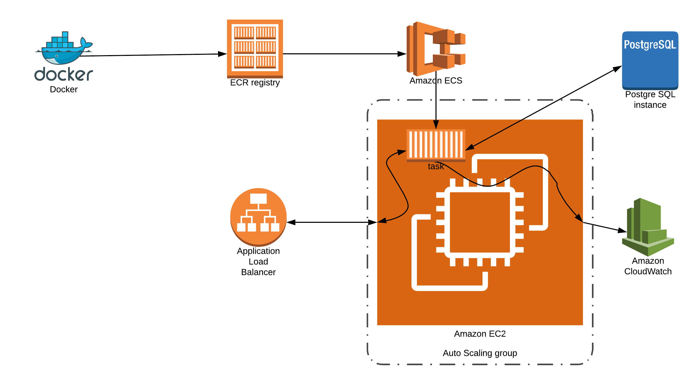

# Sonarqube in existing AWS VPC

The impetus for the creation of this [Terraform](https://www.terraform.io/) module is that most other implementations create everything - including a VPC to spin up the resources in. This module starts with the assumption that the VPC and subnets where the [Sonarqube](https://www.sonarqube.org/) container is supposed to be installed already exist. Furthermore, it assumes that the VPC and subnets are not named consistently as must be provided as variables.

This repository will create the following resources:

* ECS Cluster, Service, and Task Definition
* PostgreSQL RDS Instance for Sonarqube results
* Application Load Balancer to connect to Sonarqube UI
* Security groups
* Auto-scaling group (used by ECS Cluster)
* Cloudwatch logs for debugging purposes
* S3 bucket for load balancer access logs
* Route53 Hosted Zone entry

# Quick start

To use this module, create a main.tf and add the following module

```terraform
module "sonarqube" {
  source             = "github.com/neiman-marcus/modules/sonarqube"
  version            = "1.0"
  # required 
  region             = "us-east-1"
  vpc_id             = "vpc-00000000000000000"
  vpc_subnets        = ["subnet-11111111111111111", "subnet-22222222222222222"]
  availability_zones = ["us-east-1a", "us-east-1b"]
  lb_cert_domain     = "*.example.com" # must be existing acm cert
  lb_domain_name     = "example.com." # must be public hosted zone
  # for optional variables see variables.tf
}
```

Go into [Systems Manager Parameter Store](https://docs.aws.amazon.com/systems-manager/latest/userguide/systems-manager-parameter-store.html) and save a password for the database in a key called `/sonarqube/dbpassword`


# Architecture


## Examples

* [Minimal Example](https://github.com/neiman-marcus/nmg-sonarqube/master/examples/minimal)

## Resources

**WARNING: Only spin up 1 container at a time.** [Sonarqube](https://hub.docker.com/_/sonarqube/) warns...
>Only a single instance of SonarQube can connect to a database schema. If you're using a Docker Swarm or Kubernetes, make sure that multiple SonarQube instances are never running on the same database schema simultaneously. This will cause SonarQube to behave unpredictably and data will be corrupted.

This implementation of Sonarqube uses the `Sonarqube:lts` container from [DockerHub](https://hub.docker.com) as its default container. You are free to change the container by updating the variable `container_image`.

## Prerequisites

This Terraform module assumes that you are not creating a new VPC for this deployment. Furthermore it assumes that your VPC and Subnet names are not standard and you cannot use Terraform [data](https://www.terraform.io/docs/configuration/data-sources.html) statements to determine the IDs.

The module uses a load balancer. The balancer listens on port 443 and requires an SSL certificate. This module assumes that ACM is used for managing certficates and that the TLS certificate is created ahead of time. This is module will look for the certificate based on the domain name passed in as a variable.

To that end, the following variables must be set:

* region - The AWS region
* vpc_id - The ID of the VPC where you want to deploy
* subnet_ids - A list of private subnets
* availability_zones - A list of availability zones (that matches the subnets)
* lb_cert_domain - The domain name used to determine the ARN of the TLS certificate from ACM
* lb_domain_name - The domain name used to determine the Zone ID of the load balancer

## database.tf

The database is a straightforward PostgreSQL RDS instance. This password is stored in AWS Parameter Store and is accessed by the Terraform template at creation time and is used by the task definition to provide Sonarqube access to the database.  Note that the Sonarqube container is smart enough to recognize an empty schema during its initial startup and build the database resources it needs. Do not forget to save the database password in Parameter Store.


## ecs.tf

The Amazon AWS ECS service has the following resources defined:
1. Cluster
1. Task Definition - The best part of the task definition is embedded in a JSON template called task_definition.json.tpl.  To create this template, I manually created a temporary task definition in the AWS console and then took the task definition part out and put it in the template. Note that the aws_ecs_task_definition consists of several parts including an execution_role_arn, a container_definition, and one volume. You can have more that one volume, but I only needed one.
1. Service Definition - The service definition is the resource that binds the EC2 instance that is running the container to the application load balncer.
1. IAM Role

## lb.tf

The load balancer is a straightforward load balancer except that the target group is created, but is created with no targets. The targets are associated later by the AWS ECS service definition. There is no logging bucket for this load balancer. Feel free to change this.

## asg.tf

The autoscaling group is also straightforward. It is created using a launch template rather than a launch configuration. The other important thing to note is that it uses an ECS enabled AMI. The user data associated with the launch template sets certain variables that tweak the linux kernel parameters. Without these tweaks, the container dies. The user_data.sh.tpl template also includes a shell script function that turns on debugging.  If you do not need the debugging turned on, then comment out the statement that calls the function.

# Caveats

1. This template is specific to [AWS](https://aws.amazon.com/)
1. Using this template WILL cost you money
1. To clean up - use `terraform destroy`

# Authors

* [**Raul Dominguez**](mailto:raul_dominguez@neimanmarcus.com) - Project creation and development.

## Conduct / Contributing / License

* Refer to our contribution guidelines to contribute to this project. See [CONTRIBUTING.md](https://github.com/neiman-marcus/nmg-sonarqube/tree/master/CONTRIBUTING.md).
* All contributions must follow our code of conduct. See [CONDUCT.md](https://github.com/neiman-marcus/nmg-sonarqube/tree/master/CONDUCT.md).
* This project is licensed under the Apache 2.0 license. See [LICENSE](https://github.com/neiman-marcus/nmg-sonarqube/tree/master/LICENSE).

## Acknowledgments